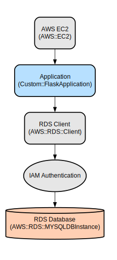

# Personal Finance Management System - Track, Budget, and Save with Ease

The Personal Finance Management System is a secure, web-based application that helps users track expenses, manage budgets, and monitor savings across different categories. Built with Flask and MySQL, it provides real-time insights into spending patterns and financial goals through an intuitive dashboard interface.

The application offers comprehensive financial management features including expense tracking with categorization, monthly budget setting, and category-specific budget goals. Users can visualize their financial data through interactive charts, track savings progress, and manage their spending across multiple categories like Food, Transport, Utilities, and more. The system is secured with scrypt password hashing and integrates with AWS RDS for reliable data storage.

## Repository Structure
```
.
├── app/                          # Main application package
│   ├── __init__.py              # Flask application initialization
│   ├── config.py                # AWS and database configuration
│   ├── models.py                # Database models for users, expenses, and budgets
│   ├── routes.py                # Application routes and view functions
│   ├── static/                  # Static assets directory
│   │   └── style.css           # Application styling
│   ├── templates/               # HTML templates
│   │   ├── dashboard.html       # Main user dashboard
│   │   ├── add_expense.html     # Expense entry form
│   │   └── *.html              # Authentication and other templates
│   └── tests/                   # Test suite directory
├── docs/                        # Documentation directory
│   └── Architecture.dot         # Architecture diagram
├── run.py                       # Application entry point
└── requirements.txt            # Project dependencies
```

## Usage Instructions
### Prerequisites
- Python 3.x
- MySQL database
- AWS account with RDS access
- SSL certificate for database connection
- Environment variables configured in `.env` file:
  - DB_USER
  - DB_PASSWORD
  - DB_HOST
  - DB_NAME
  - AWS_REGION

### Installation
```bash
# Clone the repository
git clone <repository-url>
cd Personal_Finance_Tool

# Create and activate virtual environment
python -m venv venv
source venv/bin/activate  # On Windows: venv\Scripts\activate

# Install dependencies
pip install -r requirements.txt

# Set up environment variables
cp .env.example .env
# Edit .env with your database and AWS credentials

# Initialize the database
flask db upgrade
```

### Quick Start
1. Start the application:
```bash
python run.py
```

2. Navigate to `http://localhost:5000` in your web browser
3. Register a new account or login with existing credentials
4. Access the dashboard to:
   - Add expenses
   - Set monthly budgets
   - Create budget categories
   - View financial summaries and charts

### More Detailed Examples
## API Routes

### Authentication Routes

#### 1. Register User
```http
POST /register
Content-Type: application/x-www-form-urlencoded

firstname=John&lastname=Doe&email=john@example.com&username=johndoe&password=securepass123
```

Response (Success):
```
Status: 302 Found
Location: /login
Flash Message: "Registration successful! Please log in."
```

#### 2. Login
```http
POST /login
Content-Type: application/x-www-form-urlencoded

username=johndoe&password=securepass123
```

Response (Success):
```
Status: 302 Found
Location: /dashboard
Session: Created with user_id
```

#### 3. Logout
```http
GET /logout
```

Response:
```
Status: 302 Found
Location: /login
Flash Message: "You have been logged out."
```

### Dashboard Routes

#### 4. View Dashboard
```http
GET /dashboard
```

Response:
```html
Status: 200 OK
Content-Type: text/html

<!-- Returns dashboard.html with:
  - User's expenses
  - Budget summary
  - Budget categories
-->
```

### Expense Management Routes

#### 5. Add Expense
```http
POST /add_expense
Content-Type: application/x-www-form-urlencoded

description=Grocery Shopping&amount=150.50&category=Food&date=2024-01-15
```

Response (Success):
```
Status: 302 Found
Location: /dashboard
Flash Message: "Expense added successfully!"
```

### Budget Management Routes

#### 6. Set Monthly Budget
```http
POST /Setbudget
Content-Type: application/x-www-form-urlencoded

amount=5000&month=2024-01
```

Response (Success):
```
Status: 302 Found
Location: /dashboard
Flash Message: "Budget set successfully!"
```

#### 7. Set Budget Categories
```http
POST /budget_categories
Content-Type: application/x-www-form-urlencoded

category=Food&target_amount=800&target_date=2024-01
```

Response (Success):
```
Status: 302 Found
Location: /dashboard
Flash Message: "Budget category set successfully!"
```

### Password Recovery Routes

#### 8. Forgot Password
```http
POST /forgot_password
Content-Type: application/x-www-form-urlencoded

email=john@example.com
```

Response (Success):
```
Status: 302 Found
Location: /reset_password/john@example.com
```

#### 9. Reset Password
```http
POST /reset_password/<email>
Content-Type: application/x-www-form-urlencoded

password=newSecurePass123
```

Response (Success):
```
Status: 302 Found
Location: /login
Flash Message: "Your password has been updated!"
```


### Troubleshooting
1. Database Connection Issues
   - Error: "Unable to connect to database"
   - Solution:
     ```bash
     # Verify environment variables
     echo $DB_HOST
     echo $DB_USER
     
     # Check SSL certificate
     If you would like to configure a RDS connectivity from EC2.Follow the below steps on EC2 instance:
       mkdir -p app/certs
       cd app/certs
       wget https://truststore.pki.rds.amazonaws.com/global/global-bundle.pem
       mv global-bundle.pem rds-ca-2019-root.pem
       ls app/certs/rds-ca-2019-root.pem
     ```

2. AWS Authentication Failures
   - Error: "Could not generate auth token"
   - Solution:
     ```bash
     # Verify AWS credentials
     aws configure list
     # Check region configuration in config.py
     ```

## Data Flow
The application follows a three-tier architecture where user interactions flow through the presentation layer to the business logic layer and finally to the data persistence layer.

```ascii
[User Browser] -> [Flask Routes] -> [Business Logic] -> [MySQL RDS]
     ↑               |                    ↑               |
     |               v                    |               v
[Templates] <- [View Functions] <- [Data Models] <- [AWS Auth]
```

Component interactions:
1. User requests are handled by Flask routes in `routes.py`
2. Authentication is managed through session-based login
3. Database operations use SQLAlchemy ORM for data access
4. AWS RDS connections are secured with SSL and IAM authentication
5. Charts and visualizations are generated using Chart.js
6. Budget calculations are performed in real-time
7. Password security is maintained using scrypt hashing

## Infrastructure


### Database
- RDS Database (AWS::RDS::DBInstance)
  - MySQL database instance for storing application data

### Security
- IAM Authentication
  - Connect to RDS DB securely without a password

### Application
- Flask Application (Custom::FlaskApplication)
  - Web application hosted on AWS EC2
  - Connects to RDS using IAM Authentication by Using RDS Client

 

### Networking
- AWS Region (AWS::Region)
  - Hosts all AWS resources
- RDS Client (AWS::RDS::Client)
  - Manages database authentication and connections

## Upcoming Features

### 1. Multi-Currency Support
- Currency conversion for international transactions
- Real-time exchange rate integration
- Default currency preferences
- Multi-currency reporting

### 2. Receipt Scanner Integration
- OCR-powered receipt scanning
- Automatic expense entry from photos
- Digital receipt storage and organization
- Smart merchant recognition

### 3. Recurring Transactions
- Automated tracking of subscriptions
- Bill payment reminders
- Recurring expense patterns detection
- Auto-categorization of regular payments

### 4. Financial Goals Tracking
- Custom savings targets
- Debt reduction planning
- Investment milestone tracking
- Visual progress indicators

### 5. Smart Insights and Recommendations
- AI-powered spending analysis
- Personalized budget recommendations
- Anomaly detection in spending patterns
- Monthly financial health scores

### 6. Bill Splitting Feature
- Group expense management
- Shared budget tracking
- Settlement balance calculator
- Payment request generation

### 7. Investment Portfolio Tracking
- Stock portfolio integration
- Investment performance monitoring
- Asset allocation visualization
- Dividend tracking

### 8. Tax Management Module
- Tax-deductible expense tracking
- Category-wise tax reporting
- Annual tax summary generation
- Receipt organization for tax purposes

### 9. Custom Reports Generator
- Customizable financial reports
- Multiple export formats (PDF, CSV, Excel)
- Scheduled report generation
- Interactive data visualization

### 10. Budget AI Assistant
- Natural language expense logging
- Smart financial advice
- Quick query responses
- Personalized financial insights
